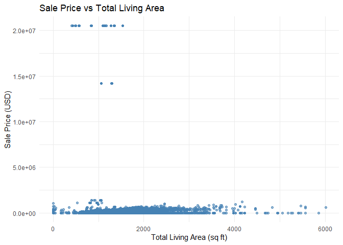
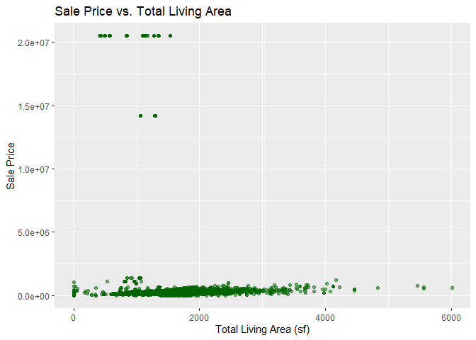

# TL;DR

- Our group focused on Sale Price as the main variable of interest.

- The distribution of sale prices is right-skewed, with most homes sold
  between \$150,000–\$300,000, a few low-value outliers under \$50,000,
  and a handful of very high-value sales above \$600,000.

- We explored TotalLivingArea (sf) as a related variable. Its
  distribution is also right-skewed, with most homes under 2,000 sq ft
  and a few very large properties above 5,000 sq ft.

- Scatterplots show a positive relationship between living area and sale
  price: generally, larger homes sell for more.

- Outliers remain: some small homes with unusually high prices (likely
  due to land value or location) and some very large homes with
  surprisingly low prices (possibly condition or neighborhood effects).

``` r
colnames(ames)
```

    ##  [1] "Parcel ID"             "Address"               "Style"                
    ##  [4] "Occupancy"             "Sale Date"             "Sale Price"           
    ##  [7] "Multi Sale"            "YearBuilt"             "Acres"                
    ## [10] "TotalLivingArea (sf)"  "Bedrooms"              "FinishedBsmtArea (sf)"
    ## [13] "LotArea(sf)"           "AC"                    "FirePlace"            
    ## [16] "Neighborhood"

``` r
str(ames)
```

    ## tibble [6,935 × 16] (S3: tbl_df/tbl/data.frame)
    ##  $ Parcel ID            : chr [1:6935] "0903202160" "0907428215" "0909428070" "0923203160" ...
    ##  $ Address              : chr [1:6935] "1024 RIDGEWOOD AVE, AMES" "4503 TWAIN CIR UNIT 105, AMES" "2030 MCCARTHY RD, AMES" "3404 EMERALD DR, AMES" ...
    ##  $ Style                : Factor w/ 12 levels "1 1/2 Story Brick",..: 2 5 5 5 NA 9 5 5 5 5 ...
    ##  $ Occupancy            : Factor w/ 5 levels "Condominium",..: 2 1 2 3 NA 2 2 1 2 2 ...
    ##  $ Sale Date            : Date[1:6935], format: "2022-08-12" "2022-08-04" ...
    ##  $ Sale Price           : num [1:6935] 181900 127100 0 245000 449664 ...
    ##  $ Multi Sale           : chr [1:6935] NA NA NA NA ...
    ##  $ YearBuilt            : num [1:6935] 1940 2006 1951 1997 NA ...
    ##  $ Acres                : num [1:6935] 0.109 0.027 0.321 0.103 0.287 0.494 0.172 0.023 0.285 0.172 ...
    ##  $ TotalLivingArea (sf) : num [1:6935] 1030 771 1456 1289 NA ...
    ##  $ Bedrooms             : num [1:6935] 2 1 3 4 NA 4 5 1 3 4 ...
    ##  $ FinishedBsmtArea (sf): num [1:6935] NA NA 1261 890 NA ...
    ##  $ LotArea(sf)          : num [1:6935] 4740 1181 14000 4500 12493 ...
    ##  $ AC                   : chr [1:6935] "Yes" "Yes" "Yes" "Yes" ...
    ##  $ FirePlace            : chr [1:6935] "Yes" "No" "No" "No" ...
    ##  $ Neighborhood         : Factor w/ 42 levels "(0) None","(13) Apts: Campus",..: 15 40 19 18 6 24 14 40 13 23 ...

``` r
head(ames)
```

    ## # A tibble: 6 × 16
    ##   `Parcel ID` Address      Style Occupancy `Sale Date` `Sale Price` `Multi Sale`
    ##   <chr>       <chr>        <fct> <fct>     <date>             <dbl> <chr>       
    ## 1 0903202160  1024 RIDGEW… 1 1/… Single-F… 2022-08-12        181900 <NA>        
    ## 2 0907428215  4503 TWAIN … 1 St… Condomin… 2022-08-04        127100 <NA>        
    ## 3 0909428070  2030 MCCART… 1 St… Single-F… 2022-08-15             0 <NA>        
    ## 4 0923203160  3404 EMERAL… 1 St… Townhouse 2022-08-09        245000 <NA>        
    ## 5 0520440010  4507 EVERES… <NA>  <NA>      2022-08-03        449664 <NA>        
    ## 6 0907275030  4512 HEMING… 2 St… Single-F… 2022-08-16        368000 <NA>        
    ## # ℹ 9 more variables: YearBuilt <dbl>, Acres <dbl>,
    ## #   `TotalLivingArea (sf)` <dbl>, Bedrooms <dbl>,
    ## #   `FinishedBsmtArea (sf)` <dbl>, `LotArea(sf)` <dbl>, AC <chr>,
    ## #   FirePlace <chr>, Neighborhood <fct>

``` r
max(ames$`Sale Price`)
```

    ## [1] 20500000

As a team, we noticed the two categorical/numeric variables, for
example, some numeric variables are Sale Price, Year Built, Acres,
TotalLivingArea, and various others. The categorial variables, such as
AC, Fireplace, and Multi Sale, indicate presence/absence features, while
numeric variables capture continuous measures like price and footage. We
predict the sales price to range from 0 to multiple millions of dollars.

# Step 2

- Our variable of interest is the sale price.

# Step 3

``` r
# Summary of Sale Price
summary(ames$'Sale Price')
```

    ##     Min.  1st Qu.   Median     Mean  3rd Qu.     Max. 
    ##        0        0   170900  1017479   280000 20500000

``` r
library(ggplot2)
salePriceGraph <- ggplot(ames, aes(x = `Sale Price`)) + 
  geom_histogram(binwidth = 50000, fill = "skyblue", color = "black")

print(salePriceGraph)
```

<!-- -->

The histogram shows that most homes are clustered around or below
\$500,000. Some oddities are present, certain values are 0 and a few
outliers were homes sold for millions but not very many overall.

``` r
boxplot(ames$`Sale Price`,
        horizontal = TRUE,
        main = "Boxplot of Sale Prices")
```

<!-- -->

The boxplot shows the skewed distribution and as well as the outliers,
which confirms what we saw in the histogram above.

# Step 3

``` r
plot(ames$`TotalLivingArea (sf)`, ames$`Sale Price`,
     main = "Sale Price vs. Living Area",
     xlab = "Total Living Area (sf)",
     ylab = "Sale Price",
     pch  = 20,
     col  = "darkgreen")
```

<!-- -->

# Step 4

- Nathan Krieger

  ``` r
  ames_clean <- ames %>%
    filter(!is.na(`Sale Price`), `Sale Price` > 0,
           !is.na(`TotalLivingArea (sf)`), `TotalLivingArea (sf)` > 0)

     # Range of TotalLivingArea (sf)
    range(ames_clean$`TotalLivingArea (sf)`)
  ```

      ## [1]    3 6007

  ``` r
    # Range of Sale Price
    range(ames_clean$`Sale Price`)
  ```

      ## [1]        1 20500000

  ``` r
  # Histogram of TotalLivingArea
  ggplot(ames, aes(x = `TotalLivingArea (sf)`)) +
    geom_histogram(binwidth = 250, fill = "lightgreen", color = "black") +
    labs(title = "Distribution of Total Living Area",
         x = "Total Living Area (sq ft)",
         y = "Number of Homes") +
    theme_minimal()
  ```

      ## Warning: Removed 447 rows containing non-finite outside the scale range
      ## (`stat_bin()`).

  <!-- -->

  ``` r
  # Scatterplot: Sale Price vs TotalLivingArea
  ggplot(ames, aes(x = `TotalLivingArea (sf)`, y = `Sale Price`)) +
    geom_point(alpha = 0.6, color = "steelblue") +
    labs(title = "Sale Price vs Total Living Area",
         x = "Total Living Area (sq ft)",
         y = "Sale Price (USD)") +
    theme_minimal()
  ```

      ## Warning: Removed 447 rows containing missing values or values outside the scale range
      ## (`geom_point()`).

  <!-- -->

  - The var I chose is TotalLivingArea (sf). I cleaned the data by
    dropping all 0 and NaN values for SQFT and sale price. I found that
    the overall distribution of SQFT is about what is expected, a right
    skewed plot. There are some homes with SQFT near 6000, but most are
    below 2000. Based off of my second plot, there appears to be a loose
    correlation between SQFT and price. The plot is mostly flat, with
    some outliers that have very high prices but low SQFT. I assume
    these are houses/properties with lots of land.

- Phillip

  ``` r
  library(ggplot2)

  # make a clean subset using base R
  ames_clean <- subset(ames,
                       !is.na(`Sale Price`) & `Sale Price` > 0 &
                       !is.na(`TotalLivingArea (sf)`))

  livingAreaPlot <- ggplot(ames_clean,
                           aes(x = `TotalLivingArea (sf)`, y = `Sale Price`)) +
    geom_point(color = "darkgreen", alpha = 0.5, size = 1.5) +
    labs(title = "Sale Price vs. Total Living Area",
         x = "Total Living Area (sf)",
         y = "Sale Price")

  print(livingAreaPlot)
  ```

  <!-- -->

  Phillip Giametta: I chose the variable Total Living Area (sF), after
  dropping the 0/NA prices, we can see a clear positive relationship
  where larger homes sell for more money. We can see evidence of a few
  large homes selling for lower than expected, which could be for
  various reasons (location, condition etc).
