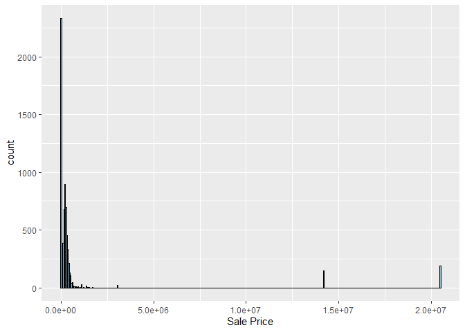
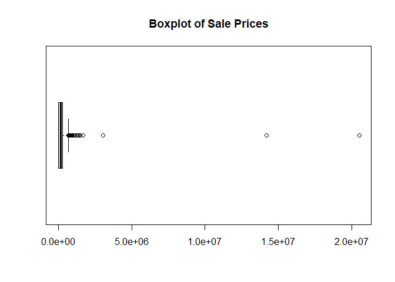
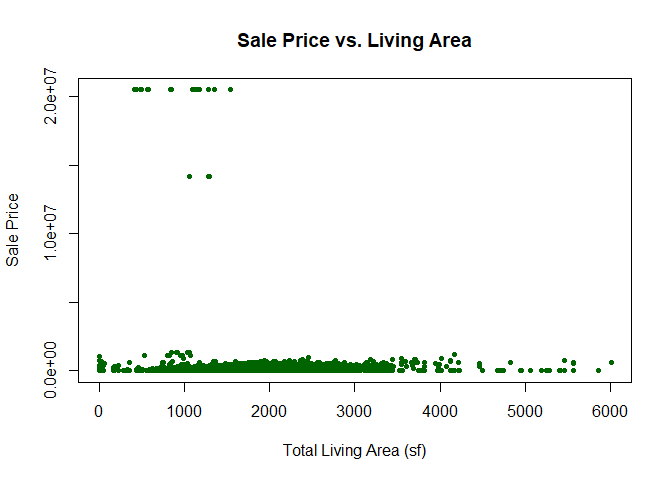
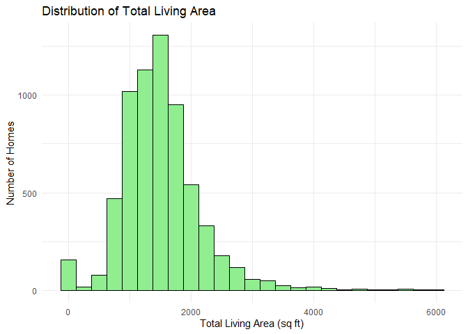

<!-- README.md is generated from README.Rmd. Please edit the README.Rmd file -->

\#Step 1

``` r
colnames(ames)
```

    ##  [1] "Parcel ID"             "Address"               "Style"                
    ##  [4] "Occupancy"             "Sale Date"             "Sale Price"           
    ##  [7] "Multi Sale"            "YearBuilt"             "Acres"                
    ## [10] "TotalLivingArea (sf)"  "Bedrooms"              "FinishedBsmtArea (sf)"
    ## [13] "LotArea(sf)"           "AC"                    "FirePlace"            
    ## [16] "Neighborhood"

``` r
str(ames)
```

    ## Classes 'tbl_df', 'tbl' and 'data.frame':    6935 obs. of  16 variables:
    ##  $ Parcel ID            : chr  "0903202160" "0907428215" "0909428070" "0923203160" ...
    ##  $ Address              : chr  "1024 RIDGEWOOD AVE, AMES" "4503 TWAIN CIR UNIT 105, AMES" "2030 MCCARTHY RD, AMES" "3404 EMERALD DR, AMES" ...
    ##  $ Style                : Factor w/ 12 levels "1 1/2 Story Brick",..: 2 5 5 5 NA 9 5 5 5 5 ...
    ##  $ Occupancy            : Factor w/ 5 levels "Condominium",..: 2 1 2 3 NA 2 2 1 2 2 ...
    ##  $ Sale Date            : Date, format: "2022-08-12" "2022-08-04" ...
    ##  $ Sale Price           : num  181900 127100 0 245000 449664 ...
    ##  $ Multi Sale           : chr  NA NA NA NA ...
    ##  $ YearBuilt            : num  1940 2006 1951 1997 NA ...
    ##  $ Acres                : num  0.109 0.027 0.321 0.103 0.287 0.494 0.172 0.023 0.285 0.172 ...
    ##  $ TotalLivingArea (sf) : num  1030 771 1456 1289 NA ...
    ##  $ Bedrooms             : num  2 1 3 4 NA 4 5 1 3 4 ...
    ##  $ FinishedBsmtArea (sf): num  NA NA 1261 890 NA ...
    ##  $ LotArea(sf)          : num  4740 1181 14000 4500 12493 ...
    ##  $ AC                   : chr  "Yes" "Yes" "Yes" "Yes" ...
    ##  $ FirePlace            : chr  "Yes" "No" "No" "No" ...
    ##  $ Neighborhood         : Factor w/ 42 levels "(0) None","(13) Apts: Campus",..: 15 40 19 18 6 24 14 40 13 23 ...

``` r
head(ames)
```

    ##    Parcel ID                       Address             Style
    ## 1 0903202160      1024 RIDGEWOOD AVE, AMES 1 1/2 Story Frame
    ## 2 0907428215 4503 TWAIN CIR UNIT 105, AMES     1 Story Frame
    ## 3 0909428070        2030 MCCARTHY RD, AMES     1 Story Frame
    ## 4 0923203160         3404 EMERALD DR, AMES     1 Story Frame
    ## 5 0520440010       4507 EVEREST  AVE, AMES              <NA>
    ## 6 0907275030       4512 HEMINGWAY DR, AMES     2 Story Frame
    ##                        Occupancy  Sale Date Sale Price Multi Sale YearBuilt
    ## 1 Single-Family / Owner Occupied 2022-08-12     181900       <NA>      1940
    ## 2                    Condominium 2022-08-04     127100       <NA>      2006
    ## 3 Single-Family / Owner Occupied 2022-08-15          0       <NA>      1951
    ## 4                      Townhouse 2022-08-09     245000       <NA>      1997
    ## 5                           <NA> 2022-08-03     449664       <NA>        NA
    ## 6 Single-Family / Owner Occupied 2022-08-16     368000       <NA>      1996
    ##   Acres TotalLivingArea (sf) Bedrooms FinishedBsmtArea (sf) LotArea(sf)  AC
    ## 1 0.109                 1030        2                    NA        4740 Yes
    ## 2 0.027                  771        1                    NA        1181 Yes
    ## 3 0.321                 1456        3                  1261       14000 Yes
    ## 4 0.103                 1289        4                   890        4500 Yes
    ## 5 0.287                   NA       NA                    NA       12493  No
    ## 6 0.494                 2223        4                    NA       21533 Yes
    ##   FirePlace              Neighborhood
    ## 1       Yes       (28) Res: Brookside
    ## 2        No    (55) Res: Dakota Ridge
    ## 3        No        (32) Res: Crawford
    ## 4        No        (31) Res: Mitchell
    ## 5        No (19) Res: North Ridge Hei
    ## 6       Yes   (37) Res: College Creek

``` r
max(ames$`Sale Price`)
```

    ## [1] 20500000

As a team, we noticed the two categorical/numeric variables, for
example, some numeric variables are Sale Price, Year Built, Acres,
TotalLivingArea, and various others. The categorial variables, such as
AC, Fireplace, and Multi Sale, indicate presence/absence features, while
numeric variables capture continuous measures like price and footage. We
predict the sales price to range from 0 to multiple millions of dollars.

\#Step 2

``` r
library(ggplot2)
salePriceGraph <- ggplot(ames, aes(x = `Sale Price`)) + 
  geom_histogram(binwidth = 50000, fill = "skyblue", color = "black")

print(salePriceGraph)
```

<!-- -->

The histogram shows that most homes are clustered around or below
\$500,000. Some oddities are present, certain values are 0 and a few
outliers were homes sold for millions but not very many overall.

``` r
boxplot(ames$`Sale Price`,
        horizontal = TRUE,
        main = "Boxplot of Sale Prices")
```

<!-- -->

The boxplot shows the skewed distribution and as well as the outliers,
which confirms what we saw in the histogram above.

\#Step 3

``` r
plot(ames$`TotalLivingArea (sf)`, ames$`Sale Price`,
     main = "Sale Price vs. Living Area",
     xlab = "Total Living Area (sf)",
     ylab = "Sale Price",
     pch  = 20,
     col  = "darkgreen")
```

<!-- --> \# Phillip’s
Step 4 exploration

``` r
library(ggplot2)

# make a clean subset using base R
ames_clean <- subset(ames,
                     !is.na(`Sale Price`) & `Sale Price` > 0 &
                     !is.na(`TotalLivingArea (sf)`))

livingAreaPlot <- ggplot(ames_clean,
                         aes(x = `TotalLivingArea (sf)`, y = `Sale Price`)) +
  geom_point(color = "darkgreen", alpha = 0.5, size = 1.5) +
  labs(title = "Sale Price vs. Total Living Area",
       x = "Total Living Area (sf)",
       y = "Sale Price")

print(livingAreaPlot)
```

<!-- -->

Phillip Giametta: I chose the variable Total Living Area (sF), after
dropping the 0/NA prices, we can see a clear positive relationship where
larger homes sell for more money. We can see evidence of a few large
homes selling for lower than expected, which could be for various
reasons (location, condition etc).
